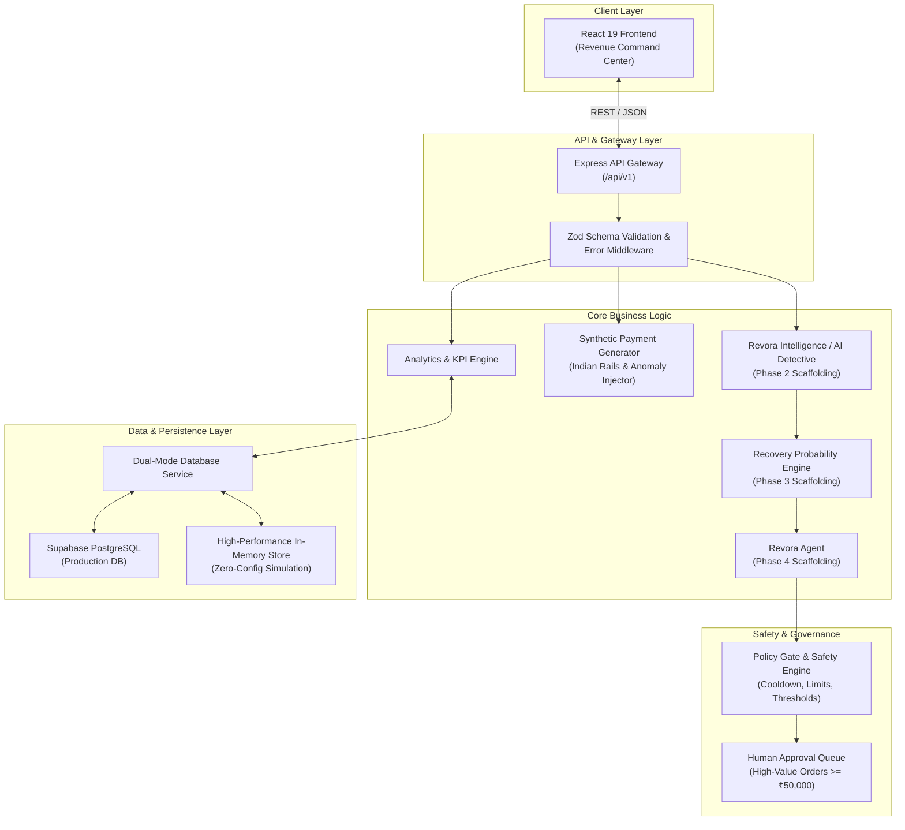

# Revora System Architecture

This document describes the end-to-end technical architecture, system components, safety model, and data flow of **Revora — AI Revenue Recovery Agent**.

---

## 1. High-Level Architecture



---

## 2. Component Breakdown

### A. Frontend (`/frontend`)
- **Framework**: React 19 + TypeScript + Vite 6.
- **Styling**: Tailwind CSS with a modern dark slate fintech theme.
- **Visualizations**: Recharts for rolling payment volume/failure trends.
- **State Management**: React state hooks with centralized API client abstraction in `/src/services/api.ts`.
- **Formatting**: Localized Indian currency formatters (`formatINR`, `formatCompactINR`) adhering to Lakhs (`₹L`) and Crores (`₹Cr`) conventions.

### B. Backend API (`/backend`)
- **Runtime**: Node.js v20+ with Express and TypeScript.
- **Architecture**: Modular Controller-Service-Repository pattern.
- **Validation**: Strict runtime validation of query parameters and request bodies using **Zod**.
- **Error Handling**: Centralized error middleware returning structured JSON error payloads.

### C. Synthetic Payment Generation Engine (`/backend/src/services/dataGenerator.ts`)
- Models realistic Indian payment behavior:
  - **UPI** (55% share): Instant payment switch with NPCI throttle simulation.
  - **Credit & Debit Cards** (35% share): 3D Secure 2.0 OTP failures and card limits.
  - **Netbanking & Wallets** (10% share): Bank CBS session timeouts.
  - **Issuer Anomaly Clustering**: Injects realistic bank outage clusters (e.g. HDFC UPI failure spike) within specified time windows to validate AI root cause analysis.

### D. Database & Storage Layer (`/database/schema.sql` & `/backend/src/services/databaseService.ts`)
- **Supabase PostgreSQL Schema**:
  - `transactions`: Core ledger tracking amounts, currencies, status, rail, error codes, and metadata.
  - `customers`: Profile data including order count, lifetime value, and preferred language (`en`, `hi`, `hinglish`).
  - `incidents`: Outage and degradation tracking for Phase 2.
  - `recovery_decisions`: Bounded action recommendations for Phase 4.
  - `audit_logs`: Immutable decision timeline for Phase 7.
- **Resilient In-Memory Fallback**: Allows the entire system to run seamlessly without requiring immediate Supabase cloud credentials.

---

## 3. Safety Architecture & Bounded Agent Execution

Revora enforces strict separation between AI decision-making and action execution:

```text
AI DECISION
     ↓
POLICY ENGINE (Safety Checks & Cooldown Validation)
     ↓
HUMAN APPROVAL GATE (if transaction >= ₹50,000)
     ↓
ACTION EXECUTOR (Bounded payment link / retry dispatch)
     ↓
AUDIT LOG (Immutable Decision Timeline)
```

### Safety Policies Enforced:
1. **Communication Limits**: Maximum 2 recovery messages per customer in 24 hours.
2. **Cooldown Periods**: Minimum 30 minutes between automated retries.
3. **Smart Silence**: Absolute suppression of customer outreach during active issuer bank outages.
4. **Financial Cap**: Transactions exceeding ₹50,000 require manual human approval in the dashboard.

---

## 4. Indian Payment Rails & Gateway Integration

Revora is architected specifically for Indian payment gateways (like Razorpay) and NPCI rails:
- **Error Taxonomy**: Gateway HTTP codes (400, 503), NPCI switch codes, bank decline codes.
- **Multi-lingual Context**: Support for English, Hindi, and Hinglish recovery messages.
- **Test Mode Parity**: Clean separation between live test credentials and synthetic simulation mode.